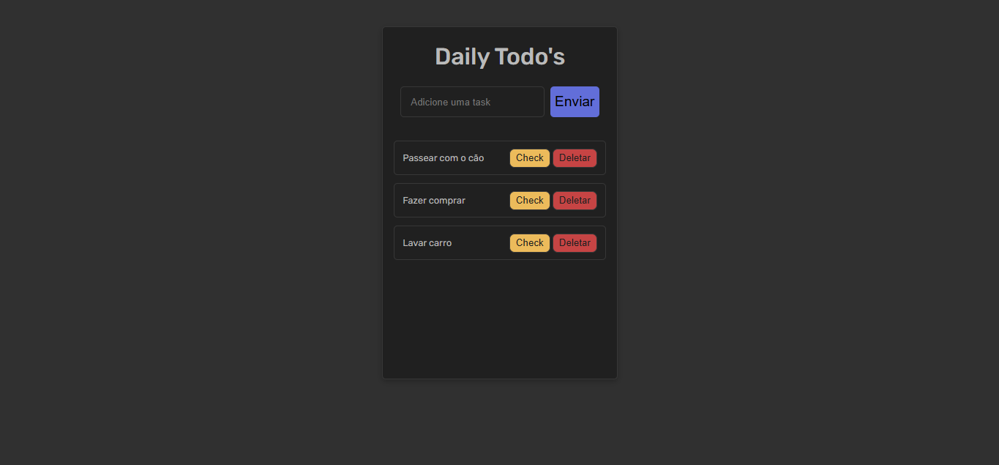

# Daily To-do's 📋

**Um simples to-do app feito com MERN stack. Foi feito em algumas horas e é um projeto simples, com foco de melhorar meu conhecimento em CRUD. O objetivo é cada vez mais deixar o app mais e mais complexo com features cada vez mais avançadas. No momento é um prótotipo simples, que aos poucos irá crescendo.**
> [!NOTE]
> O design do site foi feito com base em um design gratuito do figma: https://www.figma.com/community/file/1350344600031523800/minimal-to-do-list-app
<br>


## Tecnologias Usadas:
-  **Mongoose**
-  **Express**
-  **React**
-  **Node.js**
## Features:
> CRUD conectado com o mongoDB
- **Adicionar tasks**
- **Apagar tasks**
- **Completar tasks**
## Implementações futuras:
> Objetivo é deixar o app cada vez mais complexo
- [ ] **Edição de tasks**
- [ ] **Catálogo de tasks**
- [ ] **Login de usuários com JWT**
## Instalação:
````
  git clone https://github.com/LeiPinheiro/Fullstack_To-do.git

  cd fullstack-to-do

  npm install

  npm run dev
````
